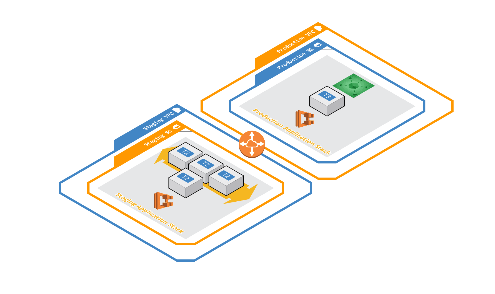

# terraform-vpc-peering
Terraform stack for establishing peering between one VPC and another between separate AWS accounts.



# Deployment

```bash
cd terraform
```

Initialise the modules.

```bash
terraform init
```

Check the plan looks correct.

```bash
terraform plan
```

Execute the Deployment.

```bash
terraform apply
```

Outputs
=======

 - `peering_connection_id` - the ID of the VPC Peering Connection.
